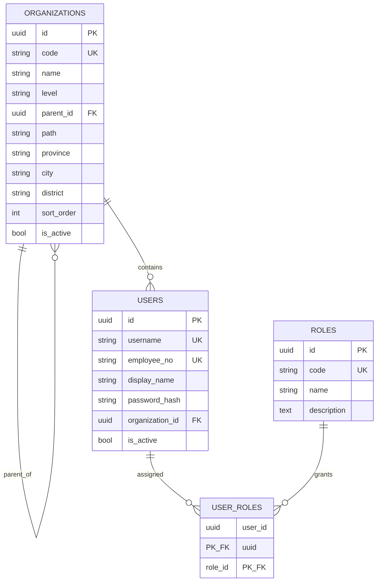

# 智拓 · 商机作战助手公共骨架搭建说明

> 版本：0.1.0  
> 日期：2026-09-22  
> 适用仓库：`ZT-Share/ZhiTuo-AI`

## 1. 本次建立了什么

本次不是重做现有 HTML，也没有删除原来的演示服务，而是在当前最新版项目旁边新增一套可供多人并行开发的后端公共骨架。

当前仓库形成两条并行路径：

1. **演示路径**：`data/智拓商机作战助手-开发版.html` + `src/ZhiTuoNativeServer.py` + `src/map_integration.py`，继续用于现阶段页面演示和需求确认。
2. **工程化路径**：`backend/` + PostgreSQL + Alembic + Docker Compose，用于逐步承接真实登录、组织权限、客户、审批、商机、拜访、共享文档、周经分、AI 与地图能力。

这样处理的目的，是让产品演示不停、后端建设也能推进，并允许团队按模块并行开发。

## 2. 我是如何建立的

### 2.1 先读取最新文件，而不是另起一套需求

我先核对了当前仓库和最新前端，确认了以下事实：

- 当前主页面位于 `data/智拓商机作战助手-开发版.html`。
- 现有 `8766` 服务已经承担页面托管、企查查和多模型 AI 网关。
- 现有 `8767` 服务承担腾讯地图、地理编码、路线和静态地图。
- 前端组织数据已经包含中国移动集团、广东分公司、深圳、广州、东莞及其区县分公司。
- 客户业务以政企客户为主，归属组织、客户经理、变更审批、删除审批、拜访和周经分已经在原型中形成较完整规则。

因此，新骨架沿用了这些业务边界和组织名称，没有修改现有页面的数据逻辑。

### 2.2 选择模块化单体，而不是立即拆微服务

当前团队规模和项目阶段更适合“模块化单体”：只有一个部署单元和一套数据库，但代码按业务域隔离。它比单文件服务更适合多人协作，又避免微服务带来的注册发现、链路追踪、分布式事务和运维成本。

业务模块边界如下：

| 模块 | 负责内容 |
| --- | --- |
| `auth` | 登录、Token、角色与授权入口 |
| `organizations` | 集团、省、市、区县、部门树和数据范围 |
| `users` | 用户、客户经理、岗位关系 |
| `customers` | 政企客户档案、归属和生命周期 |
| `approvals` | 客户变更、删除等统一审批流 |
| `opportunities` | 商机、评分、企查查线索归集 |
| `visits` | 拜访任务、行动清单、地图路线 |
| `documents` | 共享文档、版本和读写权限 |
| `reports` | 周经分、指标快照、同比环比 |
| `ai` | 模型网关、脱敏上下文、审计和用量 |

第三方能力统一放在 `app/integrations/` 下，企查查、地图和大模型不会直接散落到业务路由中。

### 2.3 先固定公共契约

所有成员共同依赖的部分已经先落地：

- API 统一前缀：`/api/v1`。
- 统一追踪号：请求和响应使用 `X-Trace-Id`。
- 统一成功结构：`success + data + traceId`。
- 统一错误结构：`success + error.code + error.message + error.details + traceId`。
- 统一错误码格式：`领域.具体错误`，例如 `AUTH.FORBIDDEN`。
- 统一分页字段：`items/page/pageSize/total/totalPages`。
- 配置和密钥只从环境变量读取，不写入代码。
- 数据库结构必须通过 Alembic 迁移，不允许成员手工改共享数据库表。

### 2.4 建立最小公共数据库

第一版迁移只建立所有业务都会用到的四张表：



客户、审批、商机等业务表没有在公共骨架中提前拍死，应由相关负责人根据最终 API 和状态机设计分别提交迁移，并由至少一名其他成员审查。

### 2.5 初始化数据与当前原型对齐

`app/scripts/seed.py` 是可重复执行的初始化脚本：

- 初始化中国移动集团、广东分公司；
- 初始化深圳、广州、东莞分公司；
- 初始化当前页面中的 28 个区县分公司；
- 为集团、省、市、区县单位初始化综合部、集客部、网络部、市场部；
- 初始化集团管理员、组织管理员、部门负责人、客户经理、只读用户五类角色；
- 使用 `code` 幂等更新，多次执行不会重复插入。

脚本没有创建弱口令管理员。共享测试环境的首个管理员应在登录模块完成后，由受控命令或统一身份平台创建。

## 3. 新目录结构

```text
ZhiTuo-AI/
├─ .env.example                 # 环境变量模板，不含真实密钥
├─ .github/workflows/
│  └─ backend-ci.yml            # 后端检查与测试
├─ backend/
│  ├─ app/
│  │  ├─ api/router.py          # 所有 v1 路由统一注册
│  │  ├─ core/                  # 配置、日志、安全、异常、响应、Trace ID
│  │  ├─ db/                    # SQLAlchemy Base、模型聚合、Session
│  │  ├─ integrations/          # 企查查、地图、大模型适配器边界
│  │  ├─ modules/               # 按业务域并行开发
│  │  ├─ scripts/seed.py        # 幂等初始化数据
│  │  └─ main.py                # FastAPI 应用工厂
│  ├─ migrations/               # Alembic 数据库迁移
│  ├─ tests/                    # 自动化测试
│  ├─ alembic.ini
│  ├─ Dockerfile
│  └─ pyproject.toml
├─ data/                        # 现有前端和演示素材，保持不动
├─ docs/
│  └─ 公共骨架搭建说明.md
├─ src/                         # 现有 8766/8767 服务，保持兼容
└─ docker-compose.yml           # API + PostgreSQL + Redis
```

## 4. 如何启动

### 4.1 推荐：Docker 一键启动

Windows 用户安装并启动 Docker Desktop 后，可以直接双击仓库根目录的
`start.cmd`。脚本将自动：

1. 检查 Docker Desktop 引擎；
2. 在缺少时由 `.env.example` 创建本地 `.env`；
3. 校验 Compose 配置；
4. 构建并启动 API、PostgreSQL、Redis；
5. 执行数据库迁移和幂等初始化；
6. 最多等待 60 秒，直到 API 和数据库健康；
7. 输出容器状态并打开 API 文档。

停止时双击 `stop.cmd`。该操作不会删除数据库数据卷。

在仓库根目录执行：

```powershell
Copy-Item .env.example .env
docker compose up --build
```

Docker 会按顺序完成：

1. 启动 PostgreSQL；
2. 启动 Redis；
3. 执行 `alembic upgrade head`；
4. 执行组织和角色初始化；
5. 启动 FastAPI。

验证地址：

- `http://127.0.0.1:8000/docs`
- `http://127.0.0.1:8000/api/v1/health/live`
- `http://127.0.0.1:8000/api/v1/health/ready`

停止服务：

```powershell
docker compose down
```

如需连同本机开发数据库数据一起清空，才使用 `docker compose down -v`。该命令会删除 PostgreSQL 和 Redis 的本地卷，执行前必须确认。

### 4.2 本地 Python 启动

需要 Python 3.10 以上，以及一套可连接的 PostgreSQL。

```powershell
Copy-Item .env.example .env
python -m venv .venv
.\.venv\Scripts\Activate.ps1
python -m pip install -e ".\backend[dev]"
Set-Location backend
alembic upgrade head
python -m app.scripts.seed
uvicorn app.main:app --reload --port 8000
```

## 5. 如何验证

在 `backend` 目录执行：

```powershell
ruff check .
pytest
```

现有测试验证：

- 根路径返回服务版本；
- 存活检查不依赖数据库；
- 每个请求自动生成追踪号；
- 调用方传入的追踪号会被保留。

`/health/ready` 会实际连接数据库。数据库未启动时返回 503 是预期行为，不代表存活检查失败。

## 6. 团队如何在骨架上并行开发

建议每个功能负责人只修改自己的模块，公共层变更单独提交：

| 开发内容 | 主要目录 | 可以依赖 | 不应直接修改 |
| --- | --- | --- | --- |
| 登录与权限 | `modules/auth`、`modules/users` | `core/security`、组织模型 | 客户业务表 |
| 组织管理 | `modules/organizations` | 公共数据库层 | AI、地图实现 |
| CRM 与审批 | `modules/customers`、`modules/approvals` | 组织、用户 service | 第三方调用细节 |
| 商机与拜访 | `modules/opportunities`、`modules/visits` | 客户 service、integrations | 登录实现细节 |
| AI/地图/外部接口 | `modules/ai`、`integrations` | 各模块提供的查询 service | 直接绕过权限查全库 |

每个新模块采用相同分层：

```text
models.py      数据库模型
schemas.py     API 输入输出模型
repository.py  只负责数据库读写
service.py     业务规则、事务和权限判断
router.py      HTTP 参数、状态码和响应
tests/         单元测试与接口测试
```

推荐分支命名：

- `feature/auth-login`
- `feature/crm-customer`
- `feature/approval-flow`
- `feature/opportunity-qcc`
- `feature/ai-gateway`
- `fix/health-readiness`

合并顺序建议：先数据库迁移和接口契约，再后端实现，最后接前端。一个 PR 只解决一个主题，必须通过 CI 和至少一次代码审查后再合并。

## 7. 现有功能如何迁移

不要一次性删除两个旧服务，按以下顺序逐步替换：

1. 新登录与组织权限先接入 `/api/v1/auth` 和 `/api/v1/organizations`。
2. 将前端内置客户迁移到客户表，再接 `/api/v1/customers`。
3. 将变更/删除审批迁移到统一 `/api/v1/approvals`。
4. 将 `ZhiTuoNativeServer.py` 的企查查逻辑迁到 `integrations/qichacha`。
5. 将 `map_integration.py` 迁到 `integrations/maps` 和 `modules/visits`。
6. 将多模型请求迁到 `integrations/llm`，AI 模块只接收脱敏且经过权限过滤的数据。
7. 前端所有接口切换完成、回归测试通过后，再下线 `8766/8767` 的旧 API。

迁移期间可以让新后端继续监听 `8000`，旧演示服务保持 `8766/8767`，互不占用端口。

## 8. 安全约束

- 真实 API Key 不得写入 HTML、Python 源码或 Git 提交。
- `.env` 已加入忽略规则，仓库只提交 `.env.example`。
- AI 请求必须先按当前用户组织范围过滤，再去除联系人、电话等不必要个人信息。
- 后端必须重新校验组织权限，不能信任前端传来的 `organizationId`。
- 金额使用数据库 `NUMERIC`，时间在数据库保存 UTC，API 使用 ISO 8601，页面按 `Asia/Shanghai` 展示。
- 删除采用审批通过后的软删除；审计日志不得由普通业务账号修改。
- 企查查和地图调用应在服务端完成，并记录调用人、用途、时间、结果和配额消耗。

特别提醒：当前仓库中的 `data/TenCentApiKey.txt` 已经被 Git 跟踪。新增 `.gitignore` 不能自动取消历史跟踪。团队应尽快轮换该密钥，并在确认新环境变量配置可用后执行：

```powershell
git rm --cached -- "data/TenCentApiKey.txt"
git commit -m "chore: stop tracking local map credential"
```

此操作只应在密钥轮换后进行；如密钥已进入公开仓库，还需要清理 Git 历史或直接废止旧密钥。

## 9. 本轮没有做什么

公共骨架只提供可共同依赖的基础设施，没有宣称以下业务已经后端化：

- 登录接口和统一身份平台对接；
- 客户、商机、拜访、审批、文档和周经分正式表；
- 前端从本地模拟数据切换到数据库；
- 企查查、地图和大模型旧代码的正式迁移；
- Redis 缓存、任务队列和文件对象存储的业务实现。

这些内容应按模块逐项开发，不能因为骨架存在就视为已经上线。

## 10. 下一阶段建议

第一轮并行开发建议只开四条线：

1. **认证与组织权限**：完成登录、Token 刷新、当前用户、组织树和数据范围依赖。
2. **客户与审批**：完成客户列表/详情、编辑申请、删除申请和审批状态机。
3. **商机与拜访**：完成商机评分持久化、拜访任务和地理路线接口。
4. **外部能力迁移**：将企查查、地图和多模型网关迁入 integrations，并补充超时、重试、限流、审计与脱敏。

每条线先提交 OpenAPI 契约和数据库迁移，再实现 service，最后接页面。这样可以最大限度减少多人同时修改同一文件造成的冲突。
